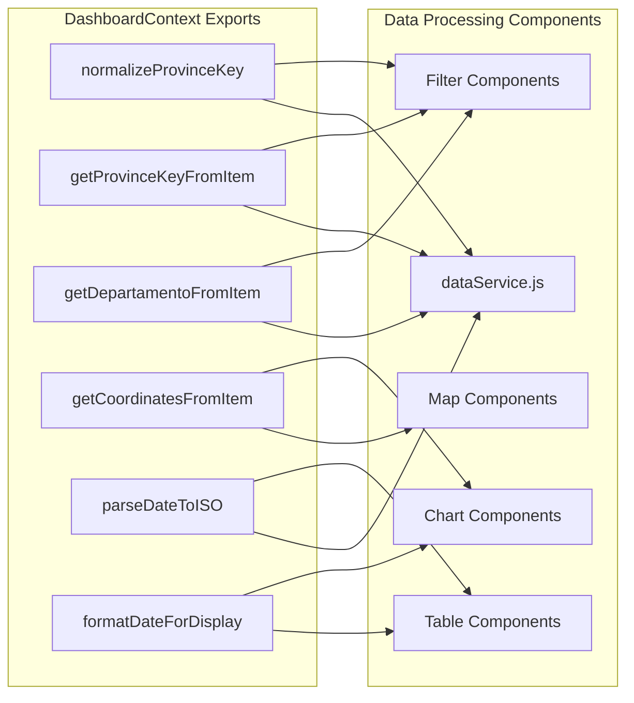
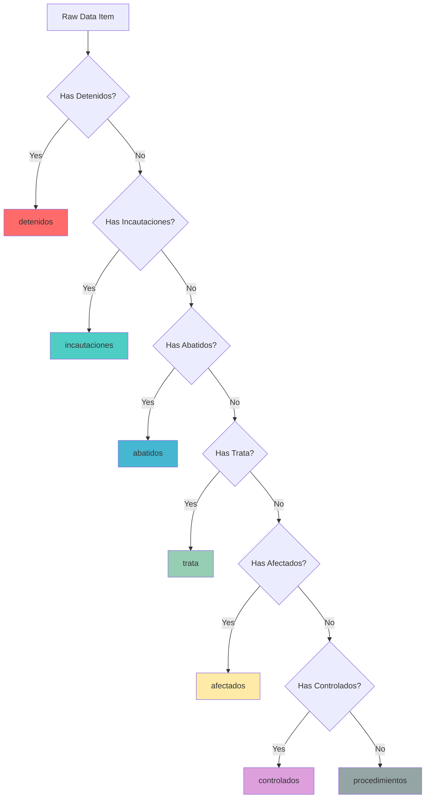
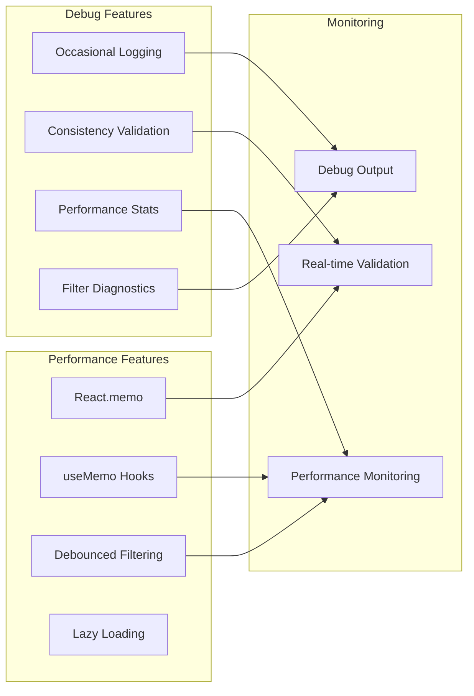
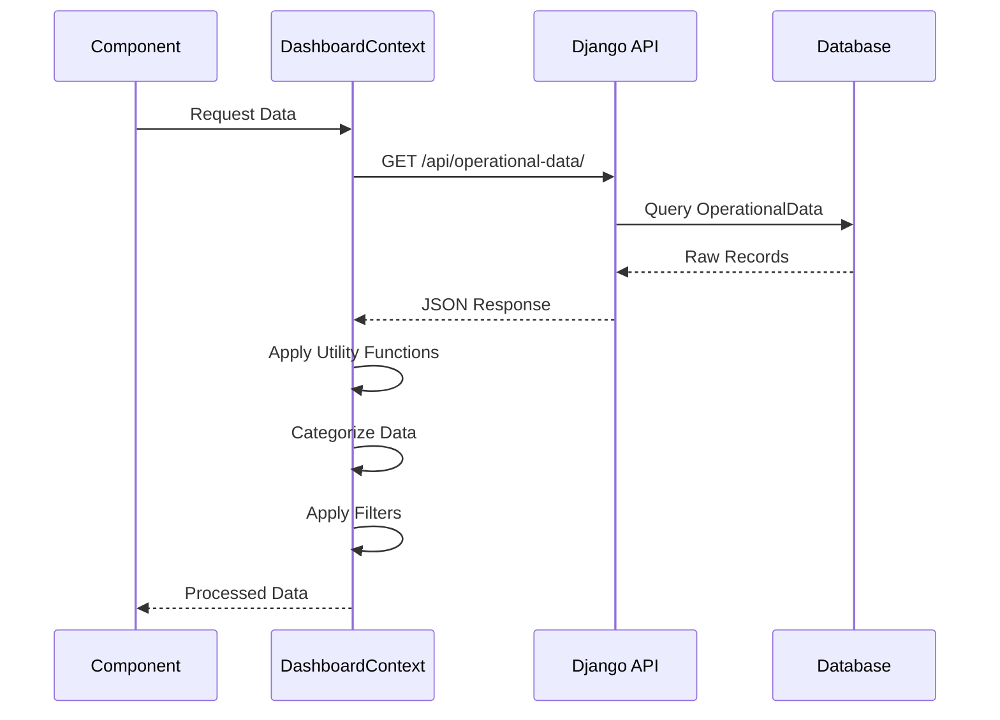
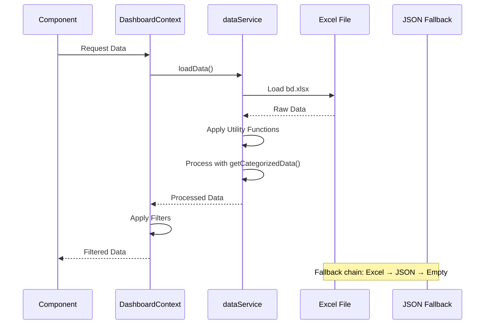

# Data Processing Architecture

## Data Processing Pipeline

```mermaid
graph TD
    subgraph "Data Sources"
        Excel[Excel Files - bd.xlsx]
        Static[Static JSON Files]
        API[REST API Endpoints]
    end
    
    subgraph "Processing Layer"
        Upload[Excel Upload Processing]
        Normalize[Data Normalization]
        Validate[Data Validation]
        Store[Database Storage]
    end
    
    subgraph "Utility Functions"
        Province[normalizeProvinceKey()]
        Coords[getCoordinatesFromItem()]
        Dates[parseDateToISO()]
        Dept[getDepartamentoFromItem()]
        Display[formatDateForDisplay()]
    end
    
    subgraph "Categorization System"
        Hierarchy[Hierarchical Categories]
        Priority[Priority Order]
        Mutual[Mutual Exclusion]
    end
    
    subgraph "Output Data"
        Filtered[Filtered Data]
        Categorized[Categorized Data]
        Statistics[Statistical Analysis]
    end
    
    Excel --> Upload
    Upload --> Normalize
    Normalize --> Validate
    Validate --> Store
    
    API --> Normalize
    Static --> Normalize
    
    Normalize --> Province
    Normalize --> Coords
    Normalize --> Dates
    Normalize --> Dept
    
    Store --> Hierarchy
    Hierarchy --> Priority
    Priority --> Mutual
    
    Mutual --> Filtered
    Filtered --> Categorized
    Categorized --> Statistics
    
    Display --> Statistics
```

## Centralized Utility Functions



## Hierarchical Categorization System



## Data Validation and Normalization

```mermaid
graph TB
    subgraph "Province Processing"
        P1[Raw Province Name]
        P2[Remove Diacritics]
        P3[Normalize Case]
        P4[Handle Special Cases]
        P5[CABA Mapping]
        P6[Normalized Key]
    end
    
    subgraph "Coordinate Processing"
        C1[Raw Coordinates]
        C2[Field Detection]
        C3[Parse Float Values]
        C4[Validate Ranges]
        C5[Exclude Invalid]
        C6[Valid Coordinates]
    end
    
    subgraph "Date Processing"
        D1[Raw Date String]
        D2[Format Detection]
        D3[Parse dd/MM/yyyy]
        D4[Convert to ISO]
        D5[Validate Date]
        D6[ISO Date String]
    end
    
    subgraph "Departamento Processing"
        DP1[Raw Item Data]
        DP2[Field Candidates]
        DP3[DEPARTAMENTO_O_PARTIDO]
        DP4[DEPARTAMENTO]
        DP5[PARTIDO]
        DP6[Validate Non-Empty]
        DP7[Department String]
    end
    
    P1 --> P2 --> P3 --> P4 --> P5 --> P6
    C1 --> C2 --> C3 --> C4 --> C5 --> C6
    D1 --> D2 --> D3 --> D4 --> D5 --> D6
    DP1 --> DP2 --> DP3 --> DP4 --> DP5 --> DP6 --> DP7
```



## Performance and Debugging



## Data Flow Patterns

### API Mode Flow


### Static Data Mode Flow
