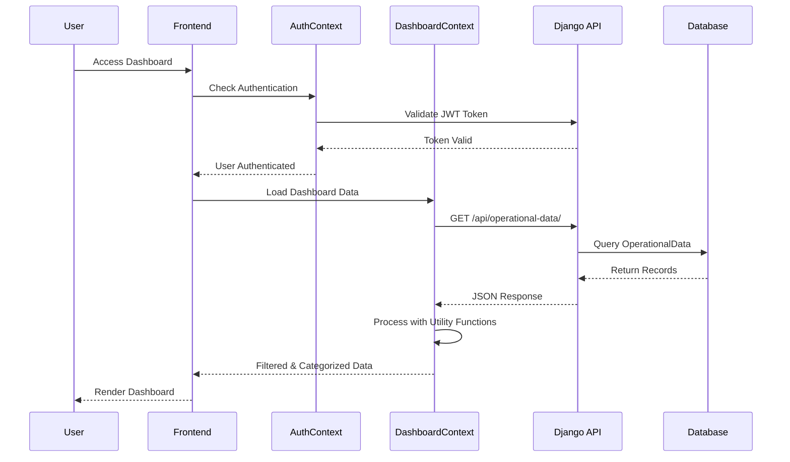
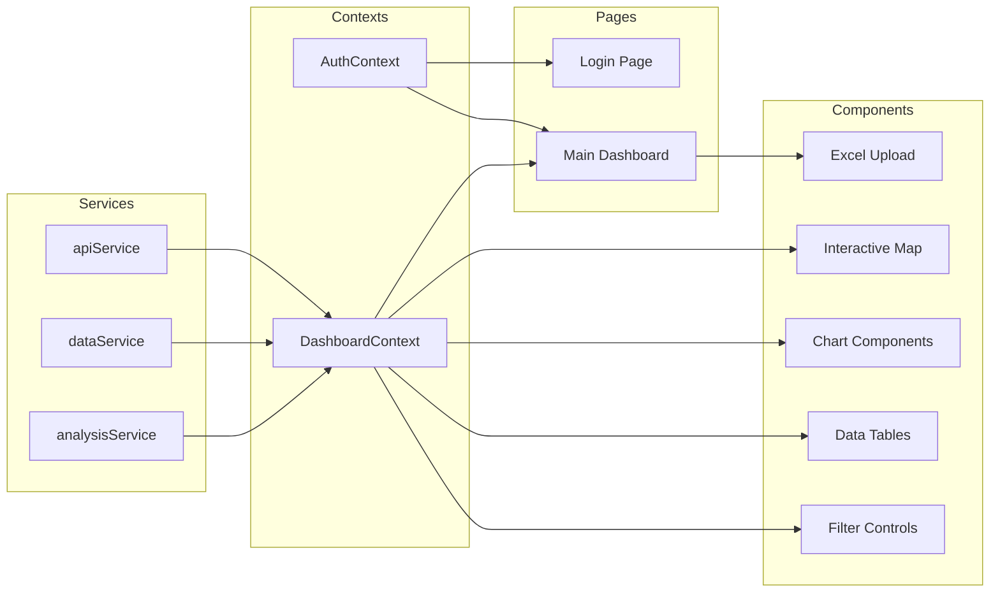
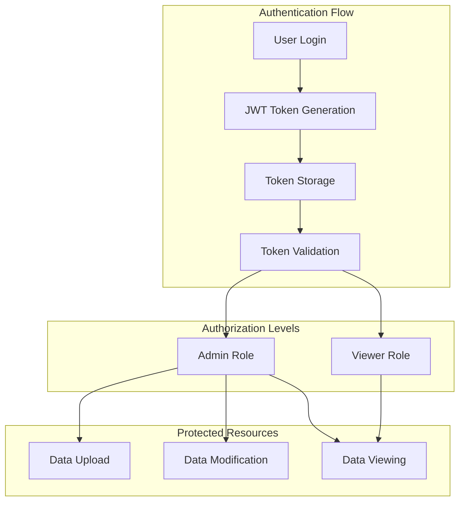
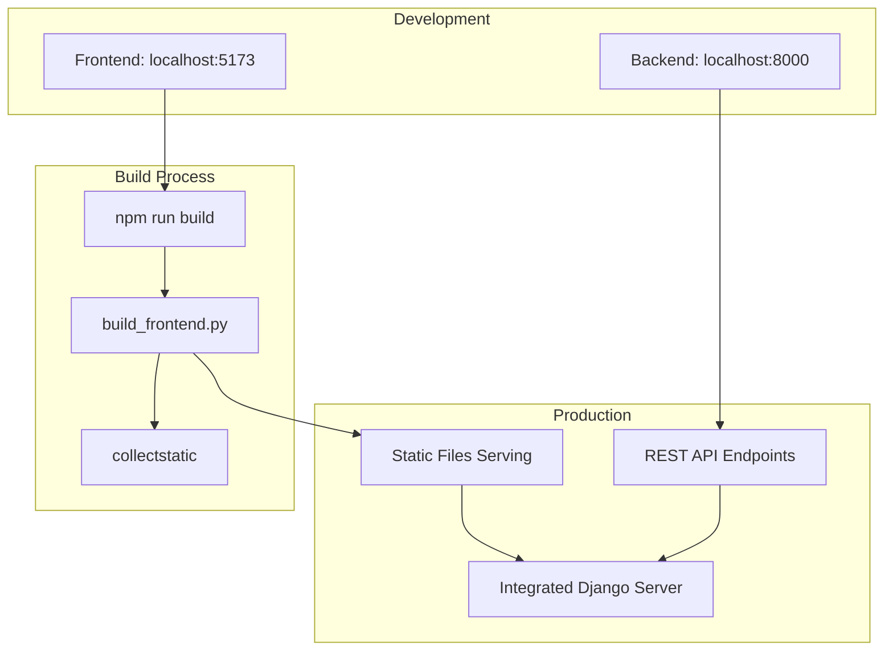

# System Architecture Overview

## High-Level Architecture

```mermaid
graph TB
    subgraph "Frontend Layer"
        React[React/Vite SPA]
        Auth[AuthContext]
        Dashboard[DashboardContext]
        Components[UI Components]
    end
    
    subgraph "Backend Layer"
        Django[Django REST API]
        JWT[JWT Authentication]
        Models[Data Models]
        Admin[Django Admin]
    end
    
    subgraph "Data Layer"
        SQLite[(SQLite Database)]
        Excel[Excel Files]
        Static[Static JSON]
    end
    
    React --> Django
    Auth --> JWT
    Dashboard --> Models
    Django --> SQLite
    Django --> Excel
    React --> Static
    
    style React fill:#61dafb
    style Django fill:#092e20
    style SQLite fill:#003b57
```

## Data Flow Architecture

## Component Architecture

## Technology Stack

### Frontend Stack
- **Framework**: React 19 with Vite
- **State Management**: React Context (AuthContext, DashboardContext)
- **UI Framework**: Material-UI v7 + Tailwind CSS
- **Routing**: React Router DOM v7
- **Charts**: Chart.js with react-chartjs-2
- **Maps**: Leaflet with react-leaflet
- **Data Processing**: XLSX library

### Backend Stack
- **Framework**: Django 5.0
- **API**: Django REST Framework
- **Authentication**: JWT (JSON Web Tokens)
- **Database**: SQLite (configurable for PostgreSQL/MySQL)
- **Static Files**: WhiteNoise
- **Data Processing**: pandas, openpyxl

### Development Tools
- **Build Tool**: Vite
- **Linting**: ESLint with React hooks plugin
- **Version Control**: Git
- **Documentation**: Markdown with Mermaid diagrams

## Security Architecture

## Deployment Architecture

